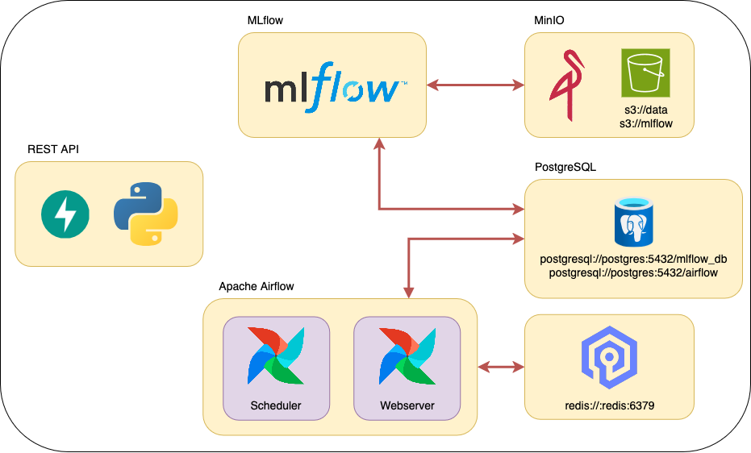

# Clasificación de crímenes de Chicago — Pipeline de MLOps

Proyecto final de MLOps1 (CEIA-FIUBA): productiviza el modelo de clasificación de
`Primary Type` (tipo de crimen, 31 clases) desarrollado en Aprendizaje de Máquina I sobre
datos de crímenes reportados en Chicago. Dado un incidente (lugar, beat policial, si hubo
arresto, si fue doméstico, fecha/hora), predice el tipo de crimen.

## Contenido del repo

- `notebook_amq1/` — notebook original de AMq1 con el EDA, la comparación de modelos
  (árbol, bagging, Random Forest, voting) y la elección del modelo final, junto con los
  datasets curados (`chicago_curado_train.csv`/`chicago_curado_test.csv`) que exporta y
  con los que entrena.
- `airflow/dags/` — DAGs de Airflow (`etl_process`, `train_model`) y el paquete
  `amq2/` con el código compartido (curado de datos, feature engineering/encoding,
  estimador, y el wrapper de MLflow que empaqueta encoders + modelo).
- `dockerfiles/` — imágenes de Airflow, MLflow, Postgres y de la API (`fastapi/`, con
  `app.py`/`schemas.py`).
- `docker-compose.yaml` / `.env` — orquestación y configuración de todos los servicios.
- [`ARQUITECTURA.md`](ARQUITECTURA.md) — detalle de cada componente (puertos, redes,
  persistencia), tareas internas de los DAGs y flujo de comunicación de punta a punta.

## Arquitectura



Servicios: [Apache Airflow](https://airflow.apache.org/) (orquestación),
[MLflow](https://mlflow.org/) (tracking + model registry),
[MinIO](https://min.io/) (data lake / artifact store, compatible con S3),
[PostgreSQL](https://www.postgresql.org/) (metadata de Airflow y de MLflow),
[Valkey](https://valkey.io/) (broker de Celery para Airflow) y una API en
[FastAPI](https://fastapi.tiangolo.com/) que sirve el modelo. El detalle completo de
cada uno (rol, puertos, qué persiste dónde) está en [`ARQUITECTURA.md`](ARQUITECTURA.md).

Al levantar los servicios se crean automáticamente los buckets `s3://data` y
`s3://mlflow`, y las bases `airflow` y `mlflow_db` en Postgres.

## Prerrequisitos

Todo el stack corre en contenedores: **no hace falta instalar Postgres, Redis, MinIO,
MLflow ni Airflow en tu máquina**, solo:

- [Docker Engine](https://docs.docker.com/engine/install/) + el plugin de Docker Compose
  (o Docker Desktop, que ya lo incluye).
- Recursos disponibles para el motor de Docker: al menos 4 CPUs y 8 GB de RAM. El
  reentrenamiento del modelo (Random Forest sobre ~190k filas) es intensivo en memoria;
  con menos de eso el DAG `train_model` puede fallar por falta de memoria.

## Despliegue

1. Clonar este repositorio.
2. Crear las carpetas que Airflow necesita y no vienen versionadas (están vacías, así
   que Git no las trackea): `airflow/config`, `airflow/logs`, `airflow/plugins`.
3. En Linux o macOS, en `.env`, reemplazar `AIRFLOW_UID` por tu UID
   (`id -u <usuario>`). Si no, Airflow deja esas carpetas como root y no vas a poder
   escribir en `airflow/logs` desde tu usuario.
4. Levantar los servicios (la primera vez construye las imágenes, puede tardar unos
   minutos):

   ```bash
   docker compose --profile all up -d --build
   ```

5. Verificar que todos los contenedores estén `healthy` con `docker ps`.
6. Subir el dataset crudo a MinIO (no se versiona en este repo por tamaño, ~65 MB). Con
   los servicios arriba:

   ```bash
   docker run --rm --network amq2-service-ml_backend --entrypoint /bin/sh \
     -v "/ruta/a/reported_crimes.csv:/data/reported_crimes.csv:ro" \
     quay.io/minio/mc:latest -c "
       mc alias set s3 http://s3:9000 minio minio123 &&
       mc cp /data/reported_crimes.csv s3/data/raw/reported_crimes.csv
     "
   ```

7. Acceder a los servicios (puertos configurables en `.env`):
   - Airflow: http://localhost:8080 (usuario/clave `airflow`/`airflow`)
   - MLflow: http://localhost:5011
   - MinIO (consola de buckets): http://localhost:9011
   - API: http://localhost:8800/ — documentación interactiva en http://localhost:8800/docs

8. Correr el pipeline desde la UI de Airflow: primero el DAG `etl_process`, y cuando
   termine, `train_model` (la búsqueda de hiperparámetros + reentrenamiento final puede
   tardar varios minutos). Al terminar, `POST /predict` en la API ya sirve el modelo
   entrenado.

Si estás en un servidor remoto en vez de tu máquina, reemplazá `localhost` por su IP.

## Apagar los servicios

```bash
docker compose --profile all down
```

Para además borrar los datos (buckets, bases de datos) y liberar espacio en disco:

```bash
docker compose down --rmi all --volumes
```

## Operación de Airflow

- **Configuración**: las variables de Airflow están en `x-airflow-common` dentro de
  `docker-compose.yaml` ([referencia completa](https://airflow.apache.org/docs/apache-airflow/stable/configurations-ref.html)).
- **Executor**: Celery — las tareas corren en el contenedor `airflow-worker`, separado
  del scheduler.
- **CLI de Airflow** (para debugging):

  ```bash
  docker compose --profile all --profile debug up -d
  docker compose run airflow-cli dags list
  ```

  ([Referencia de comandos](https://airflow.apache.org/docs/apache-airflow/stable/cli-and-env-variables-ref.html)).
- **Variables y conexiones**: se pueden versionar en `airflow/secrets/variables.yaml` y
  `airflow/secrets/connections.yaml` (no aparecen en la UI, pero existen igual), o
  cargarse desde la UI (no persisten si se borra todo). Más info:
  [variables](https://airflow.apache.org/docs/apache-airflow/stable/core-concepts/variables.html),
  [conexiones](https://airflow.apache.org/docs/apache-airflow/stable/authoring-and-scheduling/connections.html).

## Conexión a los buckets desde tu máquina

Para usar `boto3`, `awswrangler` o `awscli` contra el MinIO de este stack desde tu
propia máquina (por ejemplo, para explorar el dataset en un notebook local):

```bash
AWS_ACCESS_KEY_ID=minio
AWS_SECRET_ACCESS_KEY=minio123
AWS_ENDPOINT_URL_S3=http://localhost:9010
MLFLOW_S3_ENDPOINT_URL=http://localhost:9010
```

Si además tenés credenciales reales de AWS configuradas, revisá que no se pisen: usando
estas variables de entorno no debería haber conflicto.

## El modelo: clasificación de crímenes de Chicago

- **`etl_process`**: descarga el dataset crudo desde `s3://data/raw/reported_crimes.csv`,
  dedup por `Case Number`, split estratificado 80/20, imputación, features temporales
  cíclicas y Binary/Ordinal Encoding (ajustados solo con train) — reproduce el curado del
  notebook (`notebook_amq1/`). Guarda train/test curados y los encoders ajustados en
  `s3://data/processed/`.
- **`train_model`**: `GridSearchCV` de Random Forest (la familia de modelo elegida en el
  notebook) sobre una submuestra estratificada (la búsqueda sobre el dataset completo
  agotaba la memoria disponible localmente), reentrena el ganador con el train completo,
  y registra en el Model Registry de MLflow un `mlflow.pyfunc` que empaqueta encoders +
  clasificador (`amq2/pipeline.py`), bajo el nombre `amq2_model` con el alias `champion`.
- **API**: `POST /predict` recibe los campos crudos del incidente (ver
  `dockerfiles/fastapi/schemas.py`) y aplica el mismo feature engineering del
  entrenamiento antes de predecir, sin que quien llame necesite conocer el encoding
  interno.

Para reemplazar el dataset/modelo por otro, los 3 puntos a tocar son
`airflow/dags/amq2/data.py` (fuente de datos), `airflow/dags/amq2/model.py` (estimador y
grilla) y `dockerfiles/fastapi/schemas.py` (feature set expuesto por la API).

**Nota sobre las métricas**: el modelo servido acota `max_leaf_nodes` y busca
hiperparámetros sobre una submuestra (ver `amq2/model.py`), por las limitaciones de
memoria del entorno local usado para correr este pipeline. Sus métricas en test
(`f1_macro` ≈ 0.125) son algo más bajas que las del Random Forest del notebook original
(`f1_macro` ≈ 0.171, sin esas restricciones). Con más memoria disponible, sacar esos
límites debería acercar el resultado al del notebook.
